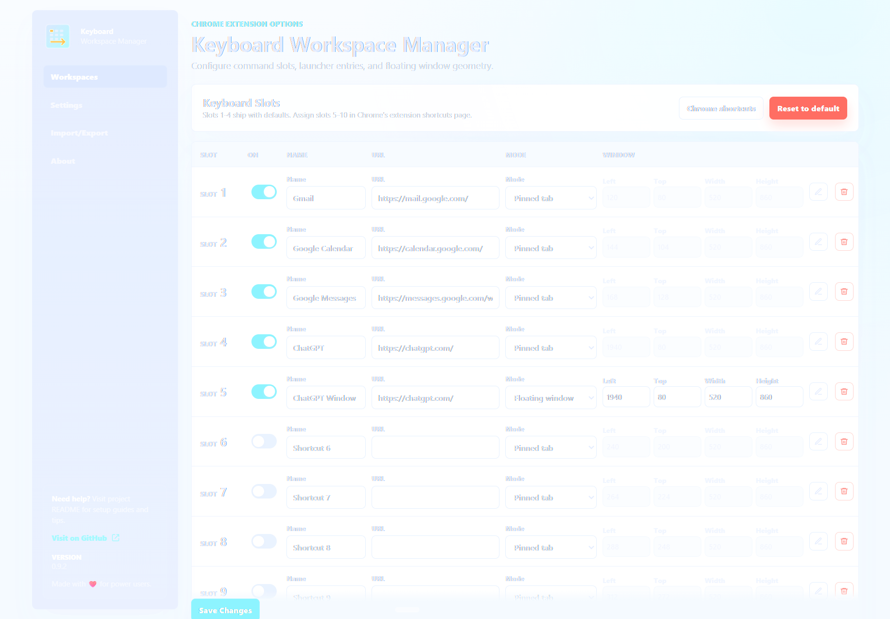
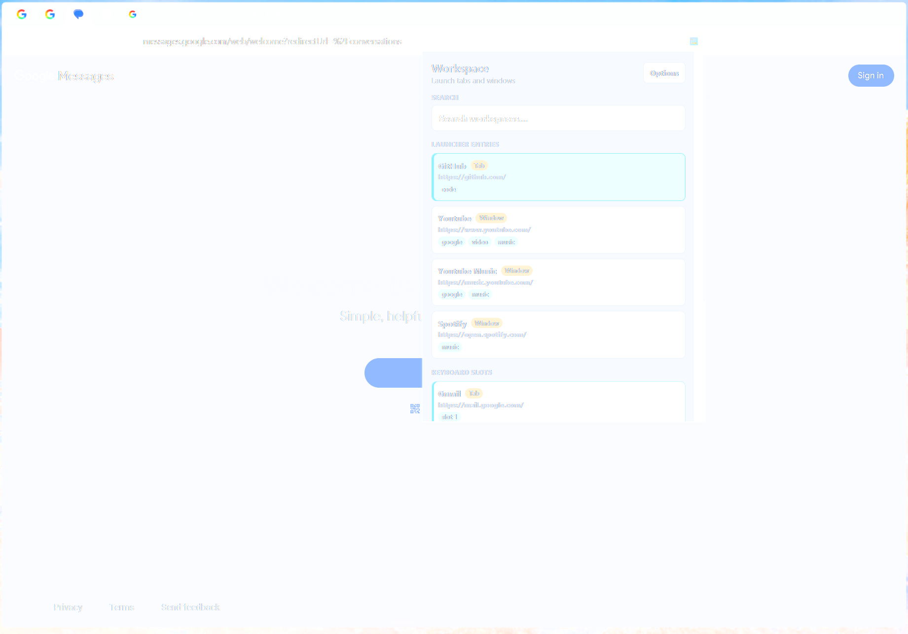
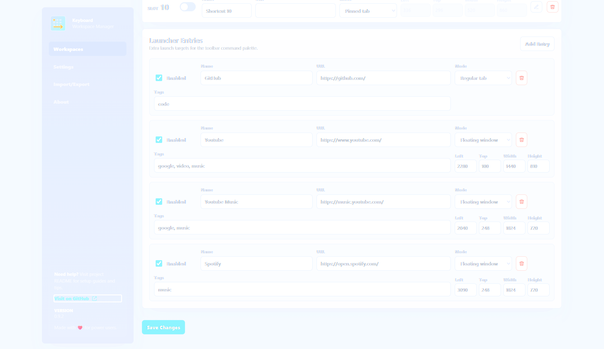
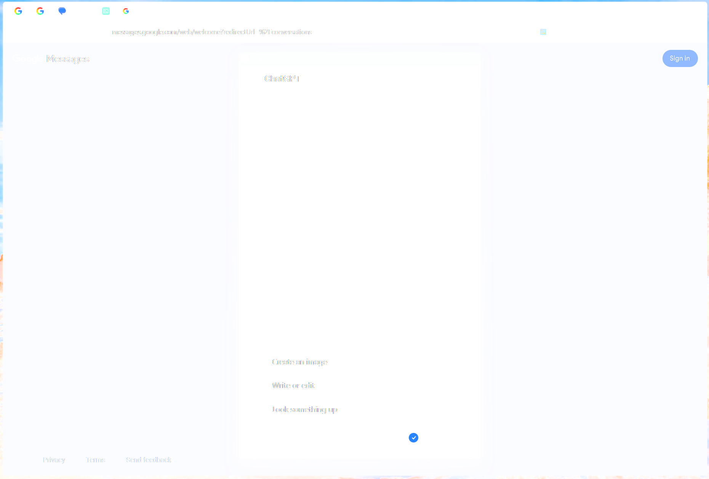

# Keyboard Workspace Manager

A production-oriented Manifest V3 Chrome extension for keyboard-driven pinned-tab workspaces on Windows.

## What It Does

- `Ctrl+Shift+1`: focus or create Gmail.
- `Ctrl+Shift+2`: focus or create Google Calendar.
- `Ctrl+Shift+3`: focus or create Google Messages.
- `Ctrl+Shift+4`: focus or create ChatGPT as a pinned tab.
- Shortcuts 5-10: assign shortcuts manually in Chrome's extension shortcuts page.
- Toolbar command palette: search and launch unlimited extra workspace entries without adding more slot shortcuts.
- Optional bookmark search in the command palette, disabled by default.

When a service tab already exists, the extension focuses its window, activates the tab, pins it, and moves it to the configured pinned index. When no matching tab exists, it creates one and applies the same rules.

## Screenshots

### Options



### Command Palette



### Command Palette - Launcher Options



### Floating Window



## Install

1. Open Chrome and go to `chrome://extensions`.
2. Enable `Developer mode`.
3. Click `Load unpacked`.
4. Select the `browser-workspace-manager` folder.
5. Open `chrome://extensions/shortcuts` and confirm the keyboard shortcuts.

Chrome allows many extension commands, but only four commands may include default suggested shortcuts in `manifest.json`. This extension ships defaults for slots 1-4. To enable slots 5-10, open `chrome://extensions/shortcuts`, find Keyboard Workspace Manager, and assign keys to `Focus Shortcut 5` through `Focus Shortcut 10`.

The toolbar command palette can also be assigned manually from the same page using `Open Command Palette`. Chrome 127 or newer is required for extensions to open their own action popup from a command. Set this shortcut to `Global`; Chrome may not dispatch browser-scoped action-popup commands consistently. The command focuses a normal Chrome window before opening the popup because Chrome action popups are attached to browser toolbar windows.

Chrome does not allow extension command shortcuts that include `Ctrl+Alt`, because that can conflict with AltGr keyboards. This is why `Ctrl+Alt+Shift+1` cannot be used directly in `manifest.json`. If you want Logitech Options+ buttons or AutoHotkey to use `Ctrl+Alt+Shift` muscle memory, bind those tools to send the Chrome-valid shortcut instead, such as `Ctrl+Shift+1`.

Chrome may also refuse a shortcut if another extension, Windows, the browser, Logitech Options+, or AutoHotkey already owns it. If that happens, set the shortcut manually at `chrome://extensions/shortcuts`, or bind your Logitech button to a less crowded shortcut such as `Ctrl+Shift+F13` and assign that shortcut in Chrome.

## Configuration

Open the extension options page from `chrome://extensions`. You can toggle debug logging, adjust pinned order healing, optionally enable bookmark search, configure shortcut slots 1-10, and tune any slot that opens as a floating window.

Each numbered shortcut slot has:

- Name shown in extension logs and options.
- URL opened when the tab does not already exist.
- Automatic host/path matching derived from the URL.
- Launch mode: pinned tab or floating window.
- Optional floating-window size and position.

Blank URLs are treated as disabled slots. Disabled slots do nothing when their command is pressed.

Pinned tab ordering is compressed across enabled pinned-tab slots only. For example, if slot 3 is configured as a floating window, then slot 4 becomes the third managed pinned tab rather than leaving an empty gap in the pinned tab strip.

Chrome does not let extensions change command names dynamically in `chrome://extensions/shortcuts`, so that page shows generic names such as `Focus Shortcut 1`. The extension options page is the source of truth for your real slot names, such as `Gmail`, `Linear`, `Notion`, or `Banking`. The manifest command ids are `focus-slot-01` through `focus-slot-10` so Chrome sorts them in slot order.

Configuring a slot in the options page does not automatically create its Chrome keyboard shortcut. Chrome keeps shortcut assignment in `chrome://extensions/shortcuts`, so use the options page to define what each slot opens and Chrome's shortcuts page to define which key triggers it.

The options page includes a `Chrome shortcuts` button. Chrome may block direct navigation to internal `chrome://` pages from extension pages; when that happens, the extension copies `chrome://extensions/shortcuts` so you can paste it into the address bar.

Use `Export` and `Import` on the options page to back up or move your settings. Use each slot's reset button to restore one slot, or `Reset Defaults` to restore the full configuration.

## Launcher Entries

Keyboard slots are fixed because Chrome extension commands must be declared ahead of time in `manifest.json`. For anything beyond slots 1-10, use Launcher Entries.

Launcher Entries are unlimited, configurable workspaces available from the extension toolbar command palette. They can open as regular tabs or floating popup windows, and they are searchable by name, URL, and tags. They do not need Chrome keyboard shortcut assignments.

In the toolbar popup, Launcher Entries and Keyboard Slots appear in one result list, with Launcher Entries ranked first. Type to filter entries and press Enter to launch the highlighted match. Open Chrome tabs also appear when they match the typed title or URL text. If bookmark search is enabled in Settings, matching bookmarks appear after open tabs and open in a new tab.

For deeper changes, edit `src/config.js`. Each service rule supports:

- `id`
- `name`
- `url`
- `match.hosts`
- `match.pathPrefixes`
- `pinnedIndex`
- `pinned`
- `windowPreference`
- optional `popup`

## Permissions

- `tabs`: required to search, activate, pin, and move tabs.
- `windows`: required to focus Chrome windows and create popup windows.
- `storage`: required for the options page and future custom settings.
- Optional `bookmarks`: requested only if you enable bookmark search in Settings. It is used locally to search bookmark titles and URLs from the command palette.

The extension does not request website host permissions, inject content scripts, or read/change page contents. It reads tab URLs locally only so it can match a configured shortcut to an already-open tab. If optional bookmark search is enabled, bookmark titles and URLs are searched locally and are not transmitted. Disabling bookmark search removes active bookmark access. Chrome may remember that you previously approved the optional permission, so re-enabling bookmark search may not show the permission prompt again.

The extension does not send data anywhere.

See `PRIVACY.md` and `STORE_LISTING.md` for Web Store-ready privacy and permissions copy. The public privacy policy is available at https://github.com/codevibr/keyboard-workspace-manager/blob/main/PRIVACY.md.

## License

Keyboard Workspace Manager is released under the MIT License. See `LICENSE` for the full license text.

## Floating Window Strategy

The extension uses `chrome.windows.create({ type: "popup" })` for slots or launcher entries configured as floating windows. This is the best built-in MV3 option for an app-like floating window. It creates a popup-style Chrome window, reuses an existing matching popup if found, focuses it, and applies configured size/position.

Chrome extension limitations:

- Extensions cannot create truly frameless windows.
- Monitor targeting is coordinate-based, not monitor-aware.
- Chrome may clamp or adjust window coordinates.
- `--app=https://chatgpt.com` launched outside Chrome often feels more app-like than an extension popup.

For stricter monitor placement, use the companion AutoHotkey v2 script in `ahk/ChatGPT-Floating-Panel.ahk`.

## AutoHotkey v2 Companion

Install AutoHotkey v2, then run:

```text
ahk/ChatGPT-Floating-Panel.ahk
```

The script binds `Ctrl+Alt+Shift+0`, focuses an existing ChatGPT Chrome app window when possible, moves it to configured monitor-2 coordinates, or launches:

```text
chrome.exe --app=https://chatgpt.com
```

You can also bind a Logitech Options+ key directly to that command or to the `.ahk` script.

## Debugging

1. Go to `chrome://extensions`.
2. Find Keyboard Workspace Manager.
3. Click `service worker`.
4. Enable debug logging in the options page.
5. Press a command shortcut and watch the logs.

Logs include command received, tab found or missing, tab created, tab moved, and window focus activity.

## Troubleshooting

- Shortcut does nothing: check `chrome://extensions/shortcuts`; Chrome may not have accepted the suggested shortcut.
- Slots 5-10 do nothing: assign those commands manually in `chrome://extensions/shortcuts`.
- Command palette shortcut only works when set to Global: this appears to be a Chrome command dispatch quirk for `chrome.action.openPopup()`. If Chrome does not dispatch a Chrome-only command, the extension never receives the shortcut event. Set `Open Command Palette` to Global. If the active window is not a normal Chrome browser window, the extension focuses a normal Chrome window before opening the palette.
- Wrong tab opens: update the service `match.hosts` and `match.pathPrefixes`.
- A shortcut opens `example.com`: set the real name and URL for that slot in extension options.
- Floating window appears on the wrong monitor: adjust `left` and `top` in options, or use the AutoHotkey companion.
- Extension stops responding briefly: MV3 service workers sleep by design. The commands API wakes the worker when a shortcut is pressed.

## Future Enhancements

- Workspace profiles with different pinned layouts.
- URL aliases per service.
- Cycling through multiple matching tabs.
- Tab group creation and color assignment.
- Startup restore that creates missing pinned tabs automatically.
- Command palette opened from the extension action.
